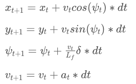

# MPC Control on Simulator
Self-Driving Car Engineer Nanodegree Program

---
This project implements a Model Predictive Controller (MPC) to drive a car in the Udacity simulator.

## Model description

A MPC determines the control inputs solving an optimization problem. It assigns a cost to each possible trayectory, and chooses the lowest. Therefore, it needs:

* A model to predict the car trajectory based on a reference state, and a set of control inputs. In this case, a kinematic model with the following equations (see `MPC.cpp` from line 99):

 

* A cost function that assigns a cost to each trajectory based on its desirability. In this case, the following components were considered: (see `MPC.cpp`from line 43)
 * Cross-track error
 * Orientation error
 * Speed (as much as possible)
 * Steering input (as few inputs as possible, to avoid swerving)
 * Actuator change (as few as possible, for a smooth ride)

## Model parameters

For the described model to work as intended, several parameters need to be tuned:

* Length of trajectory to optimize: number of points (N) and interval between them (dt). More points and a shorter polling interval would provide detailed trajectories, but at the expense of computational cost. Additionally, a `dt` value lower than the latency considered (see below), could plan unfeasible trajectories (considering more actuations than actually possible). 
	* Lengths of up to 50 points and polling intervals as low as 0.05 were tested, but ultimately N=10 and dt=0.1 were used. 
* Weights of the different cost components. As they are expressed in different units, they need to be adjusted for a balanced result. If too much weight is given to minimizing CTE, the car will stay at the center of the road even on sharp turns, making the car drive more slowly than necessary. If too much weight is assigned to changes in control inputs, the car would go unnecessarily slow: 
	*   In practice, the most delicate balance was assigning an appropiate weight to the speed component, as the optimizer would plan faster routes at the expense of staying on the road. This may have to do with the simple kinematic model, that might not consider the limits of tire adherence to keep the car on the road.  (see final weights in `MPC.cpp`from line 43).
	*   A special case would be the speed cost component. Apart from the weight, a reference speed needs to be set, so faster or slower than that speed would be penalised. We can use a very high speed (150-200mph), so we're in practice trying to drive as fast as possible, or set a conservative speed that can easily be reached throughout the track. Most tests were done with 150mph reference speed, with the MPC sucessfully keeping the car in the track with top speeds over 100mph. However, when recording [this video](https://youtu.be/EOmsxn9ZtsI "MPC on Udacity Simulator"), the car crashed as soon as the screen recording software was stopped (and started compressing the video). Further tests suggest that as soon as the MPC is slowed down by other process, it can't control the vehicle. Therefore, the reference speed for the submission has been brought back to a boring, but safe, 50mph. 

### Latency
In real systems, there will always be a latency between the time a control input is planned to when it's actually executed. In this case, we are inducing a latency of 100ms to simulate this fact (see `main.cpp`line 205). 
Considering the inputs planned in the optimizer would not be applied until 100ms later, the initial state provided to the optimizer is a prediction of 100ms into the future, using the same kinematic model equations (see `main.cpp` from line 118).
Furthermore, when using the kinematic model in the MPC, instead of assuming control inputs are applied inmediately, they were delayed by one step (see `MPC.cpp` from line 96).

## Result
This [video](https://youtu.be/EOmsxn9ZtsI "MPC on Udacity Simulator") shows the car driving around the track controlled by the MPC.

---

This project was completed for the Udacity Self Driving Car Nanodegree 

